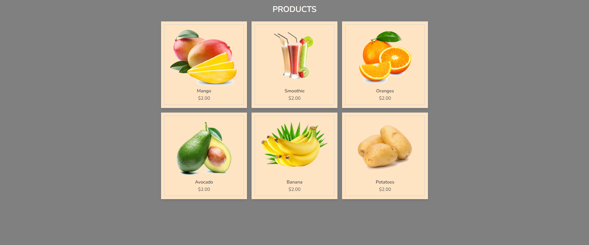
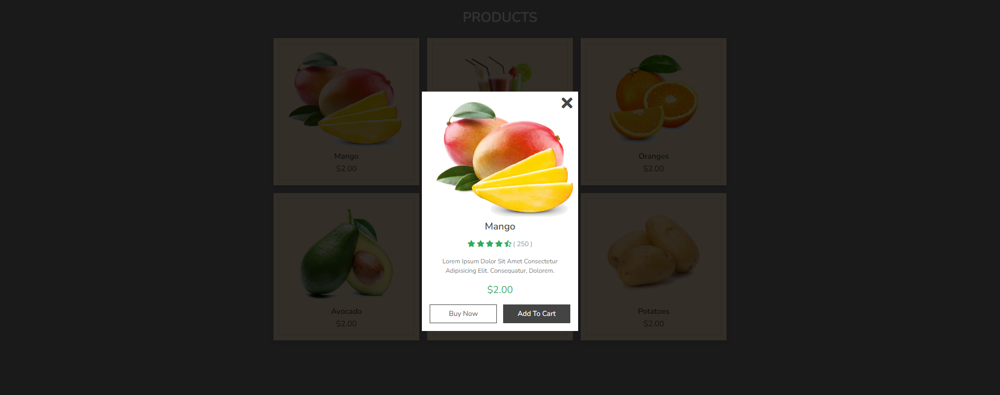

# Product Display with Preview Pop-ups

This project provides an interactive online product display with preview pop-ups for each item. The main goal is to offer users a convenient way to view product details in a pop-up overlay without leaving the main page.

## Project Description

This project allows users to browse a list of products, view detailed previews of each item, and interact with the preview by closing it or adding the item to their cart. It’s built with HTML, CSS, and JavaScript, creating a seamless and engaging user experience.

- **What it does:** Displays a list of products with pop-up previews that show product details like price, description, and rating.
- **Why these technologies:** HTML structures the content, CSS provides responsive styling, and JavaScript manages the pop-up functionality.
- **Challenges faced and future improvements:** Handling responsive design was challenging but achieved with media queries. In the future, we plan to implement a real cart system with local storage to save user selections.

## Table of Contents

- [Product Display with Preview Pop-ups](#product-display-with-preview-pop-ups)
  - [Project Description](#project-description)
  - [Table of Contents](#table-of-contents)
  - [How to Install and Run the Project](#how-to-install-and-run-the-project)
  - [How to Use the Project](#how-to-use-the-project)
  - [Credits](#credits)
  - [License](#license)

## How to Install and Run the Project

1. Clone the repository to your local machine.
   ```bash
   git clone https://github.com/Darlington2030/ecommerceCard.git
   ```
2. Ensure that all files (HTML, CSS, JavaScript) are in the same directory.
3. Open the `index.html` file in your preferred web browser to view and interact with the project.

## How to Use the Project

1. Upon opening the `index.html` file, you’ll see a product listing with images, names, and prices.
2. Click on a product to view more details in a pop-up preview.
3. To close the preview, click the close icon (X).

Example screenshots of the project layout:
-  
 
## Credits

- **Developer:** [Darlington Maloba]
- **Icons:** Font Awesome
- **CSS Framework:** Custom styles with Google Fonts ([Nunito](https://fonts.google.com/specimen/Nunito))

Special thanks to online resources for inspiration and styling tips.

## License

This project is licensed under the MIT License - see the [LICENSE](LICENSE) file for details.

